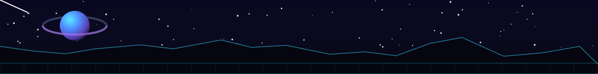

<!-- ============ COSMIC BANNER (custom animated SVG) ============ -->

  

<!-- ============ FLOATING ASTRONAUT ============ -->

  

<!-- ============ TYPING TERMINAL ============ -->
<h1 align="center">
  
</h1>

<h2 align="center">☕️ Welcome !🪐</h2>

<!-- ============ SOCIALS ============ -->

  
  &nbsp;&nbsp;
  

  

 

<!-- ============ SNAKE EATING CONTRIBUTIONS ============ -->

  <picture>
    <source media="(prefers-color-scheme: dark)" srcset="https://raw.githubusercontent.com/LEXES7/LEXES7/output/github-contribution-grid-snake-dark.svg" />
    <source media="(prefers-color-scheme: light)" srcset="https://raw.githubusercontent.com/LEXES7/LEXES7/output/github-contribution-grid-snake.svg" />
    
  </picture>

 

<!-- ============ TECH STACK ============ -->

  

  
  
  
  
  
  
  
  
  
  
  
  
  
  
  
  
  
  
  
  
  
  
  
  
  

 

<!-- ============ STATS ============ -->

  

  
  

  

 

<!-- ============ CONTRIBUTION GALAXY ============ -->

  

  

  

 

<!-- ============ COSMIC FOOTER (custom animated SVG) ============ -->

  

